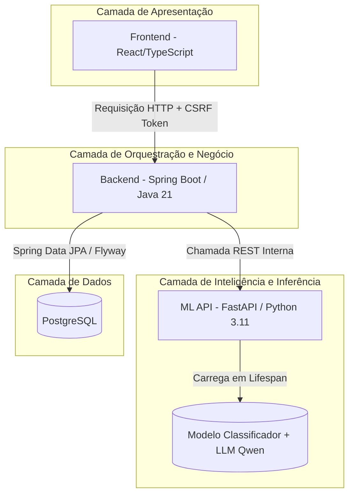

# GambIA ⚡
> **Inteligência Artificial para Otimização e Eficiência Energética**  
> *Protótipo e projeto conceitual desenvolvido de forma independente como portfólio de engenharia de software e dados.*

Este documento é o guia oficial de especificação e desenvolvimento do projeto **GambIA**. Ele serve como o memorial descritivo completo e roteiro técnico absoluto do sistema, detalhando a implementação e integração das frentes de Back-End, Ciência de Dados, Front-End e Infraestrutura Cloud.

---

## 📋 Sumário Geral do Guia
* **Parte 1**: Introdução, Contexto de Negócio e Autoria do Projeto
* **Parte 2**: Arquitetura do Sistema e Fluxo de Dados (Java, Python, OCI/AWS)
* **Parte 3**: Especificação Científica, Modelagem de ML e Motor de IA (Qwen 2.5)
* **Parte 4**: Especificação Prática da API REST e Persistência (Contrato Edital)
* **Parte 5**: Manual de Configuração de Ambiente (`.env`) e Execução Local/Docker

---

## Parte 1: Introdução, Contexto de Negócio e Autoria do Projeto

### 1.1. O Problema e a Oportunidade
A conta de energia elétrica representa uma parcela significativa dos custos fixos de residências e pequenos comércios no Brasil. No entanto, o consumidor final sofre com a **falta de visibilidade ativa**: as faturas mostram apenas o consumo consolidado em kWh no final do mês, sem detalhar quais hábitos ou equipamentos são os reais gargalos.

O **GambIA** resolve esse problema ao cruzar dados de entrada com um classificador inteligente de eficiência e um modelo de linguagem local (*AI-Native*), fornecendo não apenas o diagnóstico, mas sim um plano de ação automatizado e a estimativa financeira exata para guiar o consumo sustentável de forma interativa.

### 1.2. Regras de Negócio e Metas de Entrega
O sistema foi concebido para atender a parâmetros rígidos e profissionais de desenvolvimento de software:
* **Métrica Financeira**: Toda estimativa financeira de consumo adota a tarifa de referência de **R$ 0,75 por kWh** (baseada nas médias nacionais brasileiras da ANEEL).
* **Métrica Analítica**: Classificação do perfil de eficiência estruturada em três categorias exclusivas:
  * **Eficiente**
  * **Moderado**
  * **Ineficiente**
* **Métrica de Sustentabilidade**: Cálculo de estimativa mensal de emissões de CO₂ equivalente para engajamento ecológico do usuário.
* **Qualidade de Engenharia**: Toda a comunicação de dados e persistência é isolada de forma limpa, permitindo a transição transparente entre ambientes locais e de nuvem.

### 1.3. Autoria e Desenvolvimento
Este projeto é um protótipo conceitual e prático concebido, desenhado e implementado de forma independente por:

* **Desenvolvedor**: **José Anderson**
  * **GitHub**: [DessimA](https://github.com/DessimA)
  * **LinkedIn**: [in/dessima](https://linkedin.com/in/dessima)
  * **Perfil de Atuação**: Engenharia Full Stack (Java/Spring Boot, React/TypeScript), Ciência de Dados (Python, modelagem preditiva, LLMs locais) e DevOps (Docker, OCI/AWS).

---

## Parte 2: Arquitetura do Sistema e Fluxo de Dados

A arquitetura do **GambIA** foi desenhada seguindo padrões consolidados de sistemas distribuídos e desacoplamento de responsabilidades, garantindo que o núcleo da aplicação (regras de negócio) seja independente de tecnologias de banco de dados, frameworks ou provedores de nuvem.

### 2.1. Arquitetura Geral da Solução

O sistema opera sob um modelo de microsserviços integrados, distribuído em três camadas funcionais principais estruturadas em contêineres Docker:



### 2.2. Arquitetura Hexagonal no Back-End (Java)
A API do Back-End foi projetada seguindo os princípios da **Arquitetura Hexagonal (Ports & Adapters)**. Esta abordagem garante que o domínio de negócio do sistema não seja afetado se você decidir alterar o framework do banco de dados, o cliente HTTP ou a tecnologia de entrega.

```
backend/src/main/java/com/dessima/gambia/
│
├── domain/                    # Núcleo da Aplicação (Core)
│   ├── model/                 # Entidades de Domínio (ex: Consumo, Recomendacao)
│   ├── ports/                 # Portas (Interfaces)
│   │   ├── in/                # Casos de Uso (ex: ObterAnaliseUseCase)
│   │   └── out/               # SPIs (ex: PersistenciaPort, MLClientPort)
│   └── service/               # Serviços de Domínio (Regras de negócio puras)
│
└── adapters/                  # Adaptadores Tecnológicos (Adapters)
    ├── in/                    # Adaptadores de Entrada
    │   └── web/               # Controladores REST, DTOs de Entrada e Validadores
    └── out/                   # Adaptadores de Saída
        ├── persistence/       # Repositórios JPA, Entidades de Banco e Migrações
        └── client/            # Clientes HTTP (chamadas para a API de ML em Python)
```

### 2.3. Lógica Stateless no Serviço de ML (Python)
Para suportar com eficiência as requisições de Inteligência Artificial sem gargalos de memória na nuvem, a API Python adota um ciclo de vida estritamente **stateless**:
* **Carregamento Único (Lifespan)**: Ao iniciar a aplicação FastAPI, a rotina de startup carrega o classificador serializado (`.onnx` ou `.pkl`) e a pipeline do modelo de linguagem (Qwen 2.5) uma única vez.
* **Consumo Eficiente**: As requisições subsequentes apenas executam as inferências nos modelos que já residem na memória RAM do servidor, eliminando o atraso de carregar arquivos pesados de disco a cada chamada HTTP.

### 2.4. Fluxo de Dados de uma Requisição
1. **Entrada**: O usuário interage com o Frontend e envia os dados de consumo em formato JSON.
2. **Segurança (CSRF & JWT)**: O Frontend valida e anexa o token de segurança CSRF (recebido via cookie) no cabeçalho `X-XSRF-TOKEN` da chamada HTTP. O cookie contendo o token JWT (`httpOnly`, `Secure`, `SameSite=Strict`) é trafegado de forma segura e transparente.
3. **Orquestração**: O controlador do Spring Boot recebe a requisição, executa o Bean Validation, salva as informações de auditoria no PostgreSQL e delega a classificação de dados para a porta externa de dados (`MLClientPort`).
4. **Inferência de ML**: O Back-End efetua uma requisição interna (via rede privada OCI/AWS) para a API Python, que classifica o consumo e gera as três sugestões dinâmicas usando o modelo Qwen 2.5 local.
5. **Retorno**: A resposta é tratada, formatada, calcula-se a pegada de CO₂ e a estimativa financeira no Back-End, e as informações são persistidas no banco PostgreSQL antes de serem retornadas estruturadas ao cliente.

### 2.5. Rastreabilidade e Observabilidade Distribuída
Para permitir a depuração ágil em ambiente de portfólio de nuvem, todas as requisições utilizam cabeçalhos de contexto de rastreabilidade (**OpenTelemetry**):
* O Back-End gera um `correlation-id` (ou propaga o recebido da borda).
* Esse identificador é injetado nos logs das duas aplicações (Java e Python) e repassado como cabeçalho HTTP de correlação.
* Caso ocorra qualquer inconsistência de rede ou estouro de memória no processamento do modelo em Python, é possível rastrear o erro de ponta a ponta correlacionando os logs no Grafana através do ID unificado.

---

## Parte 3: Especificação Científica, Modelagem de Machine Learning e Motor de IA

Esta seção detalha o tratamento de dados, o treinamento do modelo preditivo de eficiência e o design do motor de IA Generativa local para a entrega de conselhos acionáveis.

---

### 3.1. Classificador de Eficiência Energética (Machine Learning)
O objetivo do modelo de aprendizado de máquina supervisionado é prever a classe de consumo (`categoria`) com base nas características estruturais e de rotina da residência.

#### A. Conjunto de Atributos (Features)
O modelo utiliza cinco variáveis de entrada para prever a eficiência:
* `consumo_kwh` (float): Volume total de energia consumida no mês.
* `uso_horario_pico` (boolean/int): Indicador de uso de eletrodomésticos no intervalo de pico (18h às 21h).
* `quantidade_equipamentos` (int): Total de aparelhos elétricos ativos na residência.
* `tipo_imovel` (string/one-hot): Categoria estrutural (Apartamento, Casa, etc.).
* `horas_alto_consumo` (int): Média diária de horas em que aparelhos de alta potência permanecem ligados.

#### B. Algoritmo e Pipeline de Treinamento
* **Tecnologia**: Python + Scikit-Learn.
* **Modelagem**: São avaliados e comparados os algoritmos de **Regressão Logística**, **Árvores de Decisão** e **Random Forest**. O modelo final escolhido (com maior F1-Score e melhor matriz de confusão) é serializado via `joblib` ou convertido para o formato otimizado **ONNX** para reduzir a latência de inferência no microsserviço FastAPI.
* **Lógica de Rotulação da Base Sintética**: Como as bases de dados reais individuais são escassas, a base sintética inicial de treino é gerada e rotulada aplicando regras limiares baseadas na relação de consumo por equipamento e horas de uso (ex: consumo acima de 400 kWh combinado com alto uso em horário de pico e mais de 6 horas de alto consumo diário é rotulado de forma determinística como *Ineficiente*).

---

### 3.2. Motor de IA Generativa Local (Recomendações)
Em vez de usar uma lista de textos estáticos no banco de dados, o **GambIA** utiliza inteligência artificial generativa local para analisar o contexto do imóvel e sugerir melhorias personalizadas.

```
+-----------------------------------+
| Inputs do Usuário + Categoria ML |
+-----------------------------------+
                  |
                  v
+-------------------------------------------------------------------------+
| Prompt System: "Você é um especialista em eficiência energética..."      |
| Prompt User: "Dados: consumo: 420kWh, categoria: Ineficiente..."        |
+-------------------------------------------------------------------------+
                  |
                  v
+-----------------------------------+
|  Modelo Qwen 2.5 1.5B (Local)     |  <-- Roda na VM de dados (4GB RAM)
+-----------------------------------+
                  |
                  v
+-------------------------------------------------------------------------+
| Retorno formatado: exatamente 3 conselhos de economia em formato JSON   |
+-------------------------------------------------------------------------+
```

#### A. Arquitetura do Modelo de Linguagem
* **Modelo**: `Qwen/Qwen2.5-1.5B-Instruct` da Alibaba.
* **Justificativa**: É um LLM altamente otimizado para instruções (*Instruct*), possuindo excelente compreensão do idioma português. Com apenas 1.5 bilhão de parâmetros, o modelo consome cerca de 3 GB de memória RAM em FP16 (ou menos de 1.5 GB se quantizado para INT4), tornando possível a sua execução local e gratuita na máquina virtual da nuvem (4 GB de RAM) auxiliada por partição de SWAP.

#### B. Estrutura do Prompt e Engenharia de Instrução
A API Python monta um prompt estruturado contendo as características da residência e o resultado do classificador. A instrução força o modelo a responder estritamente no formato de lista:

> **System Prompt**: *"Você é um assistente especialista em sustentabilidade e eficiência energética residencial. Com base nos dados que eu fornecer, gere exatamente 3 recomendações de economia de energia curtas, práticas e diretas em português. Retorne estritamente um item por linha, sem numeração, sem marcadores e sem textos explicativos adicionais antes ou depois."*
>
> **User Prompt**: *"Dados do imóvel: consumo: 420kWh, categoria de eficiência do modelo: Ineficiente, possui ar-condicionado: Sim, uso em horário de pico: Sim, horas de alto consumo: 8h por dia."*

A saída gerada é capturada pela API Python, higienizada (removendo quebras de linha indesejadas) e estruturada em um array de strings antes de retornar ao Back-End em Java.

---

### 3.3. Cálculo da Pegada de Carbono (CO₂)
Para elevar a robustez científica do portfólio, o cálculo de emissão de CO₂ do **GambIA** é baseado no **fator de emissão médio do Sistema Interligado Nacional (SIN)**, publicado oficialmente pelo Ministério da Ciência, Tecnologia e Inovação (MCTI) por meio do SIRENE.

* **Fator de Emissão Adotado**: **0,0385 kg de CO₂ por kWh** (equivalente ao índice médio anual consolidado de *0,0385 tCO₂/MWh*, o menor nível em 12 anos na matriz brasileira devido à alta participação de fontes renováveis).
* **Fórmula Aplicada**:
  $$\text{Pegada de Carbono (kg } CO_2\text{)} = \text{Consumo Mensal (kWh)} \times 0.0385$$

*Exemplo*: Uma residência que consome **420 kWh** em um mês gerará uma emissão mensal estimada de **16,17 kg de CO₂** equivalente para a atmosfera.

---

## Parte 4: Especificação Prática da API REST e Persistência

Esta seção apresenta a especificação técnica dos endpoints, as regras de validação e o esquema físico de dados, garantindo que o protótipo atenda estritamente aos requisitos de integração estabelecidos pelo edital.

---

### 4.1. Contrato da API REST
O **GambIA** expõe seus serviços de processamento de forma síncrona através de uma API REST estruturada.

#### Endpoint Principal: `POST /analise-energetica`
* **Objetivo**: Receber os dados operacionais do imóvel, acionar os motores de classificação (Machine Learning) e recomendação (IA Generativa) e retornar o diagnóstico consolidado.
* **Content-Type**: `application/json`

#### Payload de Entrada (Request Body)
O payload enviado pela aplicação cliente deve conter as seguintes chaves obrigatórias com os respectivos tipos de dados:

```json
{
  "consumo_kwh": 420,
  "uso_horario_pico": true,
  "quantidade_equipamentos": 10,
  "tipo_imovel": "Casa",
  "horas_alto_consumo": 8
}
```

##### Regras de Validação de Entrada (Spring Validation):
* `consumo_kwh`: Obrigatório (`@NotNull`), deve ser maior que zero (`@Positive`).
* `uso_horario_pico`: Obrigatório (`@NotNull`).
* `quantidade_equipamentos`: Obrigatório, deve ser maior ou igual a zero (`@Min(0)`).
* `tipo_imovel`: Obrigatório, não nulo ou em branco (`@NotBlank`), limitando-se aos valores cadastrados no dicionário de dados (ex: "Casa", "Apartamento", "Comercio").
* `horas_alto_consumo`: Obrigatório, deve estar contido no intervalo de 0 a 24 horas (`@Min(0)`, `@Max(24)`).

---

#### Payload de Saída (Response Body)
Em caso de processamento bem-sucedido (Status **200 OK**), a API deve retornar exatamente a estrutura e nomenclaturas de chaves exigidas pelas diretrizes do edital:

```json
{
  "categoria": "Ineficiente",
  "probabilidade": 0.81,
  "recomendacoes": [
    "Reduzir o uso de equipamentos durante horários de pico",
    "Avaliar aparelhos com alto consumo energético",
    "Distribuir atividades de maior consumo ao longo do dia"
  ],
  "custo_estimado_mensal": 315.00
}
```

##### Tratamento de Erros (Response 400 Bad Request):
Se qualquer validação falhar, o `GlobalExceptionHandler` do Spring interceptará a falha de validação (`MethodArgumentNotValidException`) e retornará um JSON estruturado para facilitar a correção no Frontend:

```json
{
  "timestamp": "2026-07-15T14:24:00Z",
  "status": 400,
  "erro": "Bad Request",
  "mensagem": "Falha na validação dos campos de entrada",
  "campos": {
    "horas_alto_consumo": "O valor de horas diárias de alto consumo deve estar entre 0 e 24"
  }
}
```

---

### 4.2. Modelagem Física de Dados (PostgreSQL + Flyway)
O banco de dados relacional armazena de forma estruturada as auditorias de consumo, os perfis calculados e as recomendações geradas para que o usuário possa acompanhar sua evolução.

O versionamento é gerenciado através de migrações SQL do **Flyway** estruturadas sob o diretório `backend/src/main/resources/db/migration/`.

#### Tabela 1: `tb_imovel` (Cadastro básico do imóvel)
```sql
CREATE TABLE tb_imovel (
    id UUID PRIMARY KEY,
    tipo_imovel VARCHAR(50) NOT NULL,
    quantidade_equipamentos INT NOT NULL DEFAULT 0,
    created_at TIMESTAMP WITH TIME ZONE DEFAULT CURRENT_TIMESTAMP
);
```

#### Tabela 2: `tb_analise_consumo` (Histórico de leituras e estimativas)
```sql
CREATE TABLE tb_analise_consumo (
    id UUID PRIMARY KEY,
    imovel_id UUID REFERENCES tb_imovel(id) ON DELETE CASCADE,
    consumo_kwh NUMERIC(10, 2) NOT NULL,
    uso_horario_pico BOOLEAN NOT NULL,
    horas_alto_consumo INT NOT NULL,
    categoria VARCHAR(30) NOT NULL, -- Eficiente, Moderado, Ineficiente
    probabilidade NUMERIC(5, 4) NOT NULL,
    custo_estimado_mensal NUMERIC(10, 2) NOT NULL,
    emissao_co2_kg NUMERIC(10, 3) NOT NULL, -- Cálculo do fator de emissão (SIN)
    created_at TIMESTAMP WITH TIME ZONE DEFAULT CURRENT_TIMESTAMP
);

CREATE INDEX idx_analise_imovel ON tb_analise_consumo(imovel_id);
```

#### Tabela 3: `tb_recomendacao_gerada` (Conselhos retornados pelo LLM)
```sql
CREATE TABLE tb_recomendacao_gerada (
    id UUID PRIMARY KEY,
    analise_id UUID REFERENCES tb_analise_consumo(id) ON DELETE CASCADE,
    recomendacao_texto TEXT NOT NULL,
    created_at TIMESTAMP WITH TIME ZONE DEFAULT CURRENT_TIMESTAMP
);

CREATE INDEX idx_recom_analise ON tb_recomendacao_gerada(analise_id);
```

---

## Parte 5: Manual de Configuração de Ambiente e Execução via Docker

Para garantir a portabilidade total, o isolamento de dependências e a reprodutibilidade rápida como projeto de portfólio, **o GambIA é executado exclusivamente através de contêineres e orquestração Docker**.

---

### 5.1. Configuração das Variáveis de Ambiente (`.env`)

Toda a parametrização do ecossistema de microsserviços (URLs de integração, credenciais de banco e chaves de segurança) é centralizada em um único arquivo `.env` localizado na raiz do projeto. 

Antes de iniciar, copie o modelo de exemplo fornecido no repositório:
```bash
cp .env.example .env
```

#### Modelo Oficial: `.env.example`
O arquivo de exemplo abaixo orienta quais são os dados necessários para o boot inicial do projeto. Configure o seu arquivo `.env` seguindo esta estrutura:

```env
# ==============================================================================
# GambIA - CONFIGURAÇÕES E VARIÁVEIS DE AMBIENTE (TEMPLATE)
# Copie este arquivo para .env no mesmo diretório e preencha os valores reais.
# NÃO comite o arquivo .env real no controle de versão!
# ==============================================================================

# --- AMBIENTE GERAL ---
NODE_ENV=development # development, production

# --- BANCO DE DADOS (POSTGRESQL EM CONTAINER) ---
DB_HOST=postgres-db
DB_PORT=5432
DB_NAME=gambia
DB_USER=postgres
DB_PASSWORD=postgres_password_alterar_aqui

# --- CONFIGURAÇÕES DE SEGURANÇA (JAVA BACKEND) ---
# Chave de assinatura HS256 do JWT (mínimo de 256 bits/32 caracteres para segurança)
JWT_SECRET_KEY=sua_chave_secreta_super_segura_de_32_caracteres_minimo
# Tempo de expiração do token de sessão (em milissegundos)
JWT_EXPIRATION_MS=86400000

# --- INTEGRAÇÃO COM SERVIÇOS (DIRETÓRIOS E URLs INTERNAS DO DOCKER) ---
# O backend se comunica com a API de IA através da rede interna do Docker Compose
ML_SERVICE_URL=http://ml-service:8000

# O frontend no navegador consome a API Java exposta na porta mapeada local
VITE_API_URL=http://localhost:8080

# --- CONFIGURAÇÕES DE IA (PYTHON SERVICE) ---
# Diretório do modelo dentro do container Python
ML_MODEL_PATH=models/classifier.onnx
FALLBACK_LLM_API_KEY=seu_token_opcional_para_llm_externo
ENERGY_TARIFF_REFERENCE=0.75
```

---

### 5.2. Execução Única via Docker Compose

O arquivo `docker-compose.yml` na raiz do projeto gerencia e orquestra o ciclo de vida do banco PostgreSQL, do backend Java, do microsserviço Python de IA, da interface gráfica React e da stack de observabilidade.

#### A. Inicialização do Ecossistema
Para compilar e iniciar todos os serviços em segundo plano (detached mode), execute o comando a partir do diretório raiz:
```bash
docker-compose up --build -d
```
*Este comando baixa as imagens base, compila o código do Spring Boot e do React, instala as dependências Python, configura a rede virtual privada e injeta as variáveis do seu arquivo `.env` nos contêineres correspondentes.*

#### B. Acompanhamento de Logs e Status
Para monitorar a inicialização e o tráfego de dados de forma integrada:
```bash
docker-compose logs -f
```
Para verificar a saúde dos contêineres e portas mapeadas:
```bash
docker-compose ps
```

#### C. Encerrar a Execução
Para parar e remover todos os contêineres e redes criadas:
```bash
docker-compose down
```
*Se desejar apagar os volumes persistidos do banco de dados para reiniciar os schemas do zero, adicione o parâmetro `-v` (`docker-compose down -v`).*

---

### 5.3. Portas e URLs de Acesso Local

Após o startup completo do Docker Compose, os seguintes serviços estarão disponíveis em sua máquina local:

* **Frontend Web (Interface de Usuário)**: `http://localhost:5173`
* **API Back-End (Endpoints REST)**: `http://localhost:8080`
* **API de Ciência de Dados (FastAPI / Swagger Docs)**: `http://localhost:8000/docs`
* **Painel de Observabilidade (Grafana Dashboard)**: `http://localhost:3000` *(utilize as credenciais padrão de sua stack de infraestrutura)*

---

### 5.4. Como Testar Praticamente a API

Com as rotas rodando nos contêineres Docker, você pode simular a jornada de uso do cliente enviando uma chamada de teste via `curl` no seu terminal:

```bash
curl -X POST http://localhost:8080/analise-energetica \
     -H "Content-Type: application/json" \
     -d '{
       "consumo_kwh": 420,
       "uso_horario_pico": true,
       "quantidade_equipamentos": 10,
       "tipo_imovel": "Casa",
       "horas_alto_consumo": 8
     }'
```

---