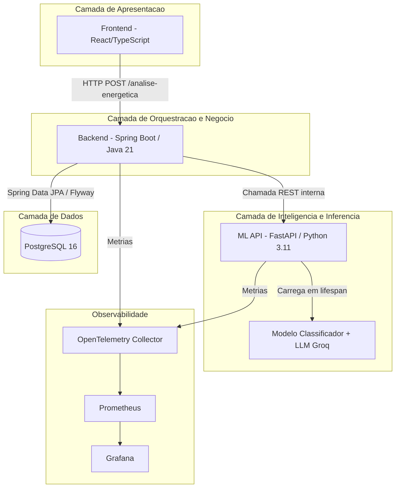
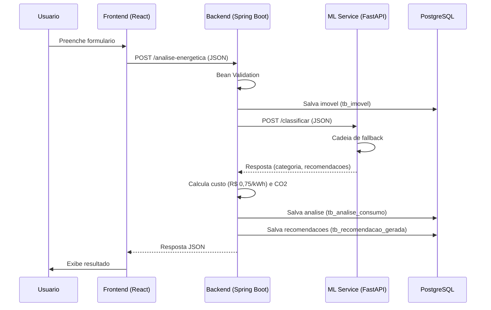
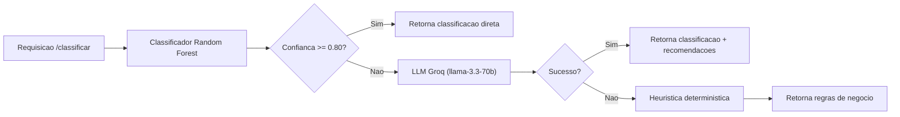
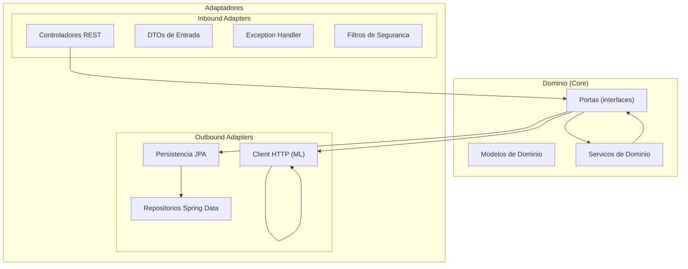

# Arquitetura do Sistema

## Visão Geral

O GambIA opera sob um modelo de microsserviços integrados, distribuído em
três camadas funcionais, todos orquestrados via Docker Compose.

## Fluxo de Dados de uma Requisição

## Cadeia de Fallback do ML

## Arquitetura Hexagonal (Backend)

## Portas e URLs de Acesso

| Serviço | URL Local | Container |
|---------|-----------|-----------|
| Frontend | `http://localhost:5173` | gambia-frontend |
| Backend API | `http://localhost:8080` | gambia-backend |
| ML Service | `http://localhost:8000` | gambia-ml |
| Swagger ML | `http://localhost:8000/docs` | gambia-ml |
| Grafana | `http://localhost:3000` | gambia-grafana |
| Prometheus | `http://localhost:9090` | gambia-prometheus |
| PostgreSQL | `localhost:5432` | gambia-postgres |
