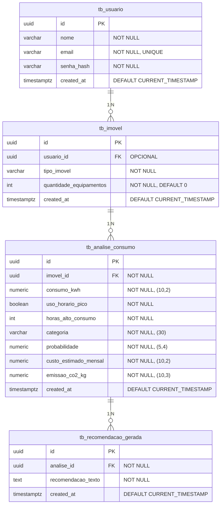

# Banco de Dados

## Tecnologias

- PostgreSQL 16 (container `postgres:16-alpine`)
- Flyway 10.20.x (migrações versionadas)
- UUID como chave primária
- Prefixo `tb_` para todas as tabelas

## Modelo Entidade-Relacionamento



## Migração V001 (Flyway)

```sql
CREATE TABLE tb_imovel (
    id UUID PRIMARY KEY,
    tipo_imovel VARCHAR(50) NOT NULL,
    quantidade_equipamentos INT NOT NULL DEFAULT 0,
    created_at TIMESTAMP WITH TIME ZONE DEFAULT CURRENT_TIMESTAMP
);

CREATE TABLE tb_analise_consumo (
    id UUID PRIMARY KEY,
    imovel_id UUID REFERENCES tb_imovel(id) ON DELETE CASCADE,
    consumo_kwh NUMERIC(10, 2) NOT NULL,
    uso_horario_pico BOOLEAN NOT NULL,
    horas_alto_consumo INT NOT NULL,
    categoria VARCHAR(30) NOT NULL,
    probabilidade NUMERIC(5, 4) NOT NULL,
    custo_estimado_mensal NUMERIC(10, 2) NOT NULL,
    emissao_co2_kg NUMERIC(10, 3) NOT NULL,
    created_at TIMESTAMP WITH TIME ZONE DEFAULT CURRENT_TIMESTAMP
);

CREATE INDEX idx_analise_imovel ON tb_analise_consumo(imovel_id);

CREATE TABLE tb_recomendacao_gerada (
    id UUID PRIMARY KEY,
    analise_id UUID REFERENCES tb_analise_consumo(id) ON DELETE CASCADE,
    recomendacao_texto TEXT NOT NULL,
    created_at TIMESTAMP WITH TIME ZONE DEFAULT CURRENT_TIMESTAMP
);

CREATE INDEX idx_recom_analise ON tb_recomendacao_gerada(analise_id);
```

## Migração V002 (Flyway)

Adiciona a tabela de usuários e vincula imóveis opcionalmente.

```sql
CREATE TABLE tb_usuario (
    id UUID PRIMARY KEY,
    nome VARCHAR(100) NOT NULL,
    email VARCHAR(255) NOT NULL UNIQUE,
    senha_hash VARCHAR(255) NOT NULL,
    created_at TIMESTAMP WITH TIME ZONE DEFAULT CURRENT_TIMESTAMP
);

ALTER TABLE tb_imovel ADD COLUMN usuario_id UUID REFERENCES tb_usuario(id);
CREATE INDEX idx_imovel_usuario ON tb_imovel(usuario_id);
```

## Descrição das Tabelas

### tb_usuario

Registro dos usuários do sistema.

| Coluna | Tipo | Descrição |
|--------|------|-----------|
| id | UUID | Chave primária |
| nome | VARCHAR(100) | Nome completo do usuário |
| email | VARCHAR(255) | Email único de login |
| senha_hash | VARCHAR(255) | Hash BCrypt da senha |
| created_at | TIMESTAMPTZ | Data de criação |

### tb_imovel

Cadastro básico do imóvel analisado.

| Coluna | Tipo | Descrição |
|--------|------|-----------|
| id | UUID | Chave primária |
| usuario_id | UUID | FK para tb_usuario (opcional, permite análises anônimas) |
| tipo_imovel | VARCHAR(50) | Casa, Apartamento, Comércio, Indústria, Rural, Outro |
| quantidade_equipamentos | INT | Quantidade de aparelhos elétricos |
| created_at | TIMESTAMPTZ | Data de criação |

Índice: `idx_imovel_usuario` em `usuario_id`.

### tb_analise_consumo

Histórico de leituras e estimativas de consumo.

| Coluna | Tipo | Descrição |
|--------|------|-----------|
| id | UUID | Chave primária |
| imovel_id | UUID | FK para tb_imovel (ON DELETE CASCADE) |
| consumo_kwh | NUMERIC(10,2) | Consumo mensal em kWh |
| uso_horario_pico | BOOLEAN | Uso no horário de pico (18h-21h) |
| horas_alto_consumo | INT | Média diária de alto consumo |
| categoria | VARCHAR(30) | Eficiente, Moderado, Ineficiente |
| probabilidade | NUMERIC(5,4) | Confiança da classificação |
| custo_estimado_mensal | NUMERIC(10,2) | R$ (consumo * 0,75) |
| emissao_co2_kg | NUMERIC(10,3) | kg CO2 (consumo * 0,0385) |
| created_at | TIMESTAMPTZ | Data de criação |

Índice: `idx_analise_imovel` em `imovel_id`.

### tb_recomendacao_gerada

Recomendações geradas pelo LLM para cada análise.

| Coluna | Tipo | Descrição |
|--------|------|-----------|
| id | UUID | Chave primária |
| analise_id | UUID | FK para tb_analise_consumo (ON DELETE CASCADE) |
| recomendacao_texto | TEXT | Texto da recomendação |
| created_at | TIMESTAMPTZ | Data de criação |

Índice: `idx_recom_analise` em `analise_id`.

## Configuração Flyway

```yaml
# application.yml
spring:
  flyway:
    enabled: true
    locations: classpath:db/migration
  jpa:
    hibernate:
      ddl-auto: validate  # Nao cria tabelas, apenas valida
```

As migrações estão em `backend/src/main/resources/db/migration/`.
