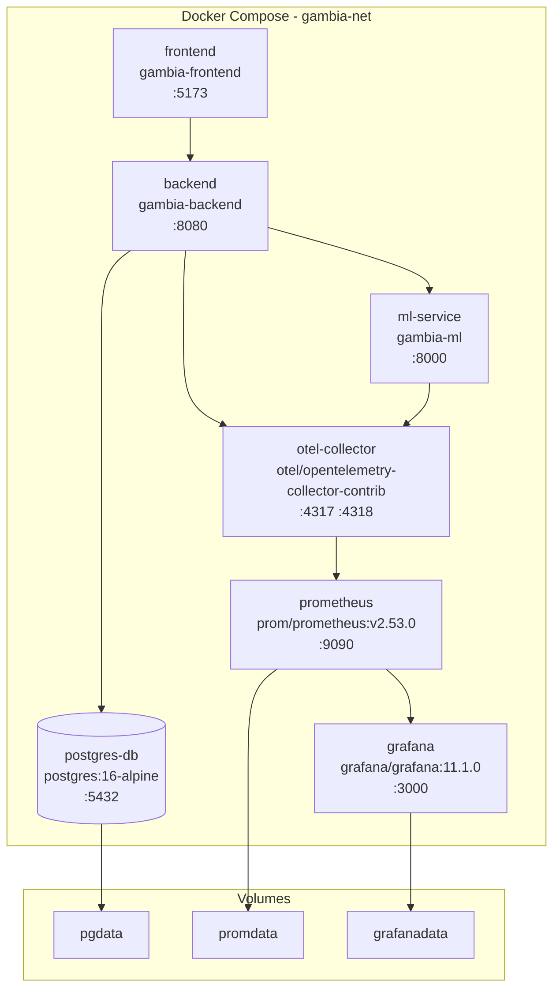

# Infraestrutura

## Docker Compose

Orquestra 7 serviços em uma rede interna (`gambia-net`).



### Dependências entre Serviços

| Serviço | Depende de | Condição |
|---------|------------|----------|
| postgres-db | - | - |
| backend | postgres-db | service_healthy |
| ml-service | - | - |
| frontend | backend | started |
| otel-collector | - | - |
| prometheus | - | - |
| grafana | prometheus | started |

### Volumes Persistentes

| Volume | Montagem | Serviço |
|--------|----------|---------|
| `pgdata` | `/var/lib/postgresql/data` | postgres-db |
| `promdata` | `/prometheus` | prometheus |
| `grafanadata` | `/var/lib/grafana` | grafana |

## Dockerfiles

### Backend (multi-stage)

- **Build**: `maven:3.9.8-eclipse-temurin-21-alpine`
  - Executa `mvn verify -B` (Spotless + compile + testes)
  - Gera JAR com dependências
- **Runtime**: `eclipse-temurin:21-jre-alpine`
  - Copia JAR do stage anterior
  - Porta 8080

### ML Service (multi-stage)

- **Builder**: `python:3.11-slim`
  - Instala dependências: `pip install .[dev]`
  - Executa `pytest`
- **Runtime**: `python:3.11-slim`
  - Copia apenas código e dependências de produção
  - Porta 8000, `uvicorn` como entrypoint

### Frontend (multi-stage)

- **Build**: `node:20-alpine`
  - Executa `npm ci && npm run build`
- **Runtime**: `nginx:alpine`
  - Copia build estático para `/usr/share/nginx/html`
  - Porta 80 (mapeada como 5173)

## Variáveis de Ambiente

Gerenciadas via `.env` na raiz do projeto (copiado de `.env.example`).

| Variável | Default | Serviço | Descrição |
|----------|---------|---------|-----------|
| `DB_HOST` | postgres-db | backend | Host do PostgreSQL |
| `DB_PORT` | 5432 | backend | Porta do PostgreSQL |
| `DB_NAME` | gambia | backend | Nome do banco |
| `DB_USER` | postgres | backend | Usuário do banco |
| `DB_PASSWORD` | - | backend | Senha do banco |
| `JWT_SECRET_KEY` | - | backend | Chave de assinatura JWT (mín. 32 chars) |
| `JWT_EXPIRATION_MS` | 86400000 | backend | Expiração do token (24h) |
| `ML_SERVICE_URL` | http://ml-service:8000 | backend | URL do ML Service interno |
| `ML_MODEL_PATH` | models/classifier.onnx | ml-service | Caminho do modelo serializado |
| `VITE_API_URL` | http://localhost:8080 | frontend | URL do backend para o navegador |
| `GROQ_API_KEY` | (vazio) | ml-service | Chave da API Groq |
| `GROQ_MODEL_ID` | llama-3.3-70b-versatile | ml-service | Modelo LLM |
| `ENERGY_TARIFF_REFERENCE` | 0.75 | ml-service | Tarifa de referência |
| `OTEL_SERVICE_NAME` | gambia-backend | backend, ml | Nome do serviço no OpenTelemetry |
| `OTEL_EXPORTER_OTLP_ENDPOINT` | http://otel-collector:4318 | backend, ml | Endpoint OTLP |

## Observabilidade

### OpenTelemetry Collector

- Imagem: `otel/opentelemetry-collector-contrib:0.104.0`
- Portas: 4317 (gRPC), 4318 (HTTP)
- Configuração: `infra/otel/otel-collector-config.yml`
- Recebe traços/métricas do backend e ML service
- Encaminha para Prometheus

### Prometheus

- Imagem: `prom/prometheus:v2.53.0`
- Porta: 9090
- Configuração: `infra/prometheus/prometheus.yml`
- Armazena métricas do OTEL collector

### Grafana

- Imagem: `grafana/grafana:11.1.0`
- Porta: 3000
- Login: admin / admin
- Provisionamento:
  - Datasource: `infra/grafana/provisioning/datasources/`
  - Dashboards: `infra/grafana/provisioning/dashboards/`

## CI/CD (GitHub Actions)

Workflow: `.github/workflows/lint.yml`

### Gatilhos

- `push` na branch `dev`
- `pull_request` para `main`

### Jobs Paralelos

```yaml
jobs:
  backend:     # Maven spotless:check + compile + test (JDK 21)
  ml-service:  # Ruff check app/ + pytest (Python 3.11)
  frontend:    # tsc --noEmit (Node 20)
```

### Histórico de Execuções

| Commit | Status | Observação |
|--------|--------|------------|
| `9ca42f6` | Pendente | Fase 2: autenticação, testes, scroll-to-top |
| `3b58e60` | Passou | Último commit aprovado no lint |
| `8dbcd31` | Falhou | Ruff I001 em heuristica.py (corrigido) |
| `d7e9309` | Falhou | Ruff N806 em classificador.py (corrigido) |
