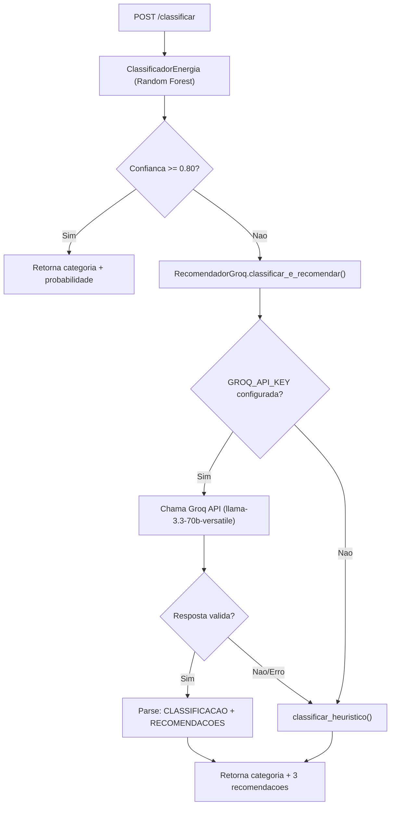

# ML Service - FastAPI / Python 3.11

## Estrutura

```
ml-service/
+-- Dockerfile                    # Multi-stage: builder (pytest) + runtime
+-- pyproject.toml                # Dependências + config pytest
+-- app/
|   +-- __init__.py
|   +-- main.py                   # FastAPI app, lifespan, CORS
|   +-- api/
|   |   +-- __init__.py
|   |   +-- classificar.py        # POST /classificar
|   +-- core/
|   |   +-- __init__.py
|   |   +-- classificador.py      # ClassificadorEnergia (Random Forest)
|   |   +-- cadeia_fallback.py    # Cadeia: ML -> LLM -> Heurística
|   |   +-- llm_gerador.py        # RecomendadorGroq
|   |   +-- heuristica.py         # Fallback determinístico
|   +-- models/
|       +-- __init__.py
|       +-- schemas.py            # Pydantic models
+-- tests/
    +-- __init__.py
    +-- conftest.py               # Fixtures pytest (classificador, client ASGI)
    +-- test_schemas.py           # Validação Pydantic (9 testes)
    +-- test_api.py               # Endpoint /classificar (6 testes)
    +-- test_classificador.py     # Classificação e recomendações (8 testes)
    +-- test_heuristica.py        # Regras de negócio determinísticas (8 testes)
    +-- test_cadeia_fallback.py   # Fluxo ML->LLM->Heurística (4 testes)
```

## Endpoints

### POST /classificar

Request:
```json
{
  "consumo_kwh": 420,
  "uso_horario_pico": true,
  "quantidade_equipamentos": 10,
  "tipo_imovel": "Casa",
  "horas_alto_consumo": 8
}
```

Response:
```json
{
  "categoria": "Ineficiente",
  "probabilidade": 0.81,
  "recomendacoes": [
    "Reduzir o uso de equipamentos durante horários de pico",
    "Avaliar aparelhos com alto consumo energético",
    "Distribuir atividades de maior consumo ao longo do dia"
  ]
}
```

### GET /health

```json
{ "status": "ok" }
```

## Cadeia de Fallback

A lógica de classificação segue três níveis de fallback:

1. **Classificador Random Forest**: treinado com dados sintéticos. Se confiança >= 0.80, retorna direto.
2. **LLM Groq**: se confiança baixa ou chave configurada, chama `llama-3.3-70b-versatile` para classificar e recomendar.
3. **Heurística determinística**: último recurso, baseada em regras de negócio fixas.



## ClassificadorEnergia

### Treinamento Sintético

Gera 500 amostras sintéticas com regras limiares:

```python
consumo > 400 and horas > 6 and pico  -> Ineficiente
consumo > 200 or horas > 4            -> Moderado
otherwise                              -> Eficiente
```

### Features (5 atributos)

| Feature | Tipo | Descrição |
|---------|------|-----------|
| consumo_kwh | float | Volume mensal de consumo |
| uso_horario_pico | int (0/1) | Uso no horário de pico (18h-21h) |
| quantidade_equipamentos | int | Total de aparelhos |
| tipo_imovel | int (0-5) | Categoria do imóvel (one-hot encoded) |
| horas_alto_consumo | float | Média diária de alto consumo |

### Algoritmo

- Random Forest Classifier (scikit-learn)
- 100 árvores (n_estimators), profundidade máxima 10
- StandardScaler para normalização
- random_state=42 para reprodutibilidade

## LLM Gerador (Groq)

### Configuração

| Variável | Default | Descrição |
|----------|---------|-----------|
| `GROQ_API_KEY` | (vazio) | Chave de API Groq |
| `GROQ_MODEL_ID` | `llama-3.3-70b-versatile` | Modelo LLM |

Sem `GROQ_API_KEY`, o LLM é desabilitado e o fallback vai direto para a heurística.

### Prompt System (classificar_e_recomendar)

```
Você é um especialista em eficiência energética.
Classifique o imóvel como Eficiente, Moderado ou Ineficiente com base
nos dados fornecidos e gere 3 recomendações de economia de energia
curtas e práticas em português.

Responda no formato exato abaixo (sem textos extras):
CLASSIFICACAO: <Eficiente|Moderado|Ineficiente>
RECOMENDACOES:
- <recomendação 1>
- <recomendação 2>
- <recomendação 3>
```

### Prompt System (gerar recomendações)

Usado quando o classificador já definiu a categoria (fluxo normal com alta confiança).

```
Você é um assistente especialista em sustentabilidade e eficiência
energética residencial. Com base nos dados que eu fornecer, gere
exatamente 3 recomendações de economia de energia curtas, práticas e
diretas em português. Retorne estritamente um item por linha, sem
numeração, sem marcadores e sem textos explicativos adicionais antes
ou depois.
```

## Heurística Determinística (Último Fallback)

Regras de negócio estáticas quando ML e LLM falham:

```python
consumo > 400 and horas > 6 and pico  -> Ineficiente
consumo > 200 or horas > 4            -> Moderado
otherwise                              -> Eficiente
```

## Constantes

| Constante | Valor | Descrição |
|-----------|-------|-----------|
| Tarifa de referência | R$ 0,75/kWh | Usada no backend (não no ML) |
| Fator CO2 | 0,0385 kg/kWh | Usado no backend (não no ML) |
| Limiar de confiança | 0.80 | Mínimo para pular LLM |

## Testes (pytest)

35 testes automatizados com `pytest-asyncio`:

| Arquivo | Qtde | Escopo |
|---------|------|--------|
| `test_schemas.py` | 9 | Validação Pydantic (consumo_kwh>0, horas<=24, enums) |
| `test_api.py` | 6 | POST /classificar com diversas entradas |
| `test_classificador.py` | 8 | Classificação, recomendações por categoria |
| `test_heuristica.py` | 8 | Regras de negócio determinísticas, valores zero |
| `test_cadeia_fallback.py` | 4 | Fluxo: ML confiança alta -> LLM -> heurística |

### Configuração (pyproject.toml)

```toml
[tool.pytest.ini_options]
asyncio_mode = "auto"
testpaths = ["tests"]
```

### Dockerfile

O build segue estratégia multi-stage:
- **builder**: instala dependências com `.[dev]`, executa `pytest`
- **runtime**: copia apenas o código e dependências de produção (sem dev)

```dockerfile
FROM python:3.11-slim AS builder
COPY . .
RUN pip install .[dev] && pytest

FROM python:3.11-slim AS runtime
COPY --from=builder /app /app
CMD ["uvicorn", "app.main:app", "--host", "0.0.0.0", "--port", "8000"]
```
