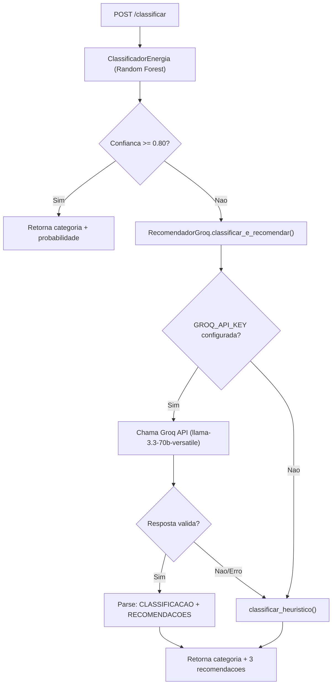

# ML Service - FastAPI / Python 3.11

## Estrutura

```
ml-service/
+-- Dockerfile
+-- pyproject.toml
+-- app/
|   +-- __init__.py
|   +-- main.py                 # FastAPI app, lifespan, CORS
|   +-- api/
|   |   +-- __init__.py
|   |   +-- classificar.py      # POST /classificar
|   +-- core/
|   |   +-- __init__.py
|   |   +-- classificador.py    # ClassificadorEnergia (Random Forest)
|   |   +-- cadeia_fallback.py  # Cadeia: ML -> LLM -> Heuristica
|   |   +-- llm_gerador.py      # RecomendadorGroq
|   |   +-- heuristica.py       # Fallback determinístico
|   +-- models/
|       +-- __init__.py
|       +-- schemas.py          # Pydantic models
+-- tests/
    +-- __init__.py
```

## Endpoints

### POST /classificar

Request:
```json
{
  "consumo_kwh": 420,
  "uso_horario_pico": true,
  "quantidade_equipamentos": 10,
  "tipo_imovel": "Casa",
  "horas_alto_consumo": 8
}
```

Response:
```json
{
  "categoria": "Ineficiente",
  "probabilidade": 0.81,
  "recomendacoes": [
    "Reduzir o uso de equipamentos durante horarios de pico",
    "Avaliar aparelhos com alto consumo energetico",
    "Distribuir atividades de maior consumo ao longo do dia"
  ]
}
```

### GET /health

```json
{ "status": "ok" }
```

## Cadeia de Fallback

A lógica de classificação segue três níveis de fallback:



## ClassificadorEnergia

### Treinamento Sintético

Gera 500 amostras sintéticas com regras limiares:

```python
consumo > 400 and horas > 6 and pico  -> Ineficiente
consumo > 200 or horas > 4            -> Moderado
otherwise                              -> Eficiente
```

### Features (5 atributos)

| Feature | Tipo | Descrição |
|---------|------|-----------|
| consumo_kwh | float | Volume mensal de consumo |
| uso_horario_pico | int (0/1) | Uso no horário de pico (18h-21h) |
| quantidade_equipamentos | int | Total de aparelhos |
| tipo_imovel | int (0-5) | Categoria do imóvel (one-hot encoded) |
| horas_alto_consumo | float | Média diária de alto consumo |

### Algoritmo

- Random Forest Classifier (scikit-learn)
- 100 árvores (n_estimators), profundidade máxima 10
- StandardScaler para normalização
- random_state=42 para reproducibilidade

## LLM Gerador (Groq)

### Configuração

| Variável | Default | Descrição |
|----------|---------|-----------|
| `GROQ_API_KEY` | (vazio) | Chave de API Groq |
| `GROQ_MODEL_ID` | `llama-3.3-70b-versatile` | Modelo LLM |

Sem `GROQ_API_KEY`, o LLM é desabilitado e o fallback vai direto para a heurística.

### Prompt System (classificar_e_recomendar)

```
Voce e um especialista em eficiencia energetica.
Classifique o imovel como Eficiente, Moderado ou Ineficiente com base
nos dados fornecidos e gere 3 recomendacoes de economia de energia
curtas e praticas em portugues.

Responda no formato exato abaixo (sem textos extras):
CLASSIFICACAO: <Eficiente|Moderado|Ineficiente>
RECOMENDACOES:
- <recomendacao 1>
- <recomendacao 2>
- <recomendacao 3>
```

### Prompt System (gerar recomendações)

Usado quando o classificador já definiu a categoria (fluxo normal).

```
Voce e um assistente especialista em sustentabilidade e eficiencia
energetica residencial. Com base nos dados que eu fornecer, gere
exatamente 3 recomendacoes de economia de energia curtas, praticas e
diretas em portugues. Retorne estritamente um item por linha, sem
numeracao, sem marcadores e sem textos explicativos adicionais antes
ou depois.
```

## Heurística Determinística (Último Fallback)

Regras de negócio estáticas quando ML e LLM falham:

```python
consumo > 400 and horas > 6 and pico  -> Ineficiente
consumo > 200 or horas > 4            -> Moderado
otherwise                              -> Eficiente
```

## Constantes

| Constante | Valor | Descrição |
|-----------|-------|-----------|
| Tarifa de referência | R$ 0,75/kWh | Usada no backend (não no ML) |
| Fator CO2 | 0,0385 kg/kWh | Usado no backend (não no ML) |
| Limiar de confiança | 0.80 | Mínimo para pular LLM |
