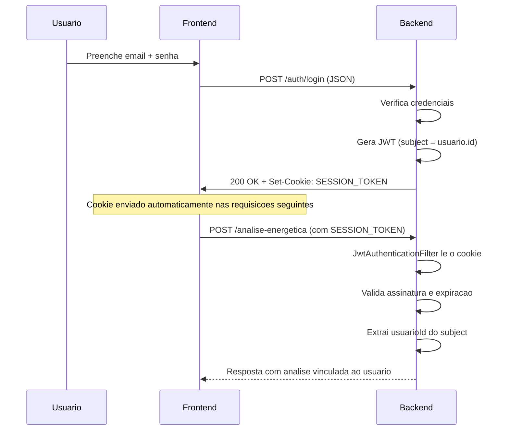

# Segurança

## Autenticação (JWT)

O GambIA utiliza JWT (JSON Web Token) armazenado em cookie httpOnly para
autenticação de usuários. O token é gerado no login/cadastro e incluído na
resposta como cookie `SESSION_TOKEN` (`httpOnly`, `Secure`, `SameSite=Strict`).

### Fluxo



### JwtTokenProvider

- Algoritmo: HS256 (HMAC-SHA256)
- Chave: derivada de `JWT_SECRET_KEY` (mínimo 32 caracteres)
- Expiração: configurada via `JWT_EXPIRATION_MS` (default 24h)
- Claims: `sub` (ID do usuário como string), `iat`, `exp`

### JwtAuthenticationFilter

- Estende `OncePerRequestFilter`
- Lê o cookie `SESSION_TOKEN` de cada requisição
- Se válido, extrai `usuarioId` do subject e cria `UsernamePasswordAuthenticationToken`
  com role `ROLE_USER`
- Se inválido ou ausente, apenas continua a cadeia (não bloqueia)

### Endpoints de Autenticação

#### POST /auth/cadastrar

- **Request**: `{ nome, email, senha }`
- **Response 201**: Corpo vazio + cookie `SESSION_TOKEN`. Frontend chama login em seguida para obter dados.
- **Erros**: 400 se email já cadastrado ou validação falhar

#### POST /auth/login

- **Request**: `{ email, senha }`
- **Response 200**: `{ id, nome, email }` + cookie `SESSION_TOKEN`
- **Erros**: 400 se credenciais inválidas

## CSRF (Double Submit Cookie)

Proteção contra Cross-Site Request Forgery via Double Submit Cookie Pattern.

### Configuração (SecurityConfig.java)

```java
http.csrf(csrf ->
    csrf.csrfTokenRepository(CookieCsrfTokenRepository.withHttpOnlyFalse())
        .csrfTokenRequestHandler(csrfHandler)
        .ignoringRequestMatchers("/analise-energetica", "/auth/**"))
```

### Fluxo

1. Backend define cookie `XSRF-TOKEN` (não-httpOnly, legível por JS)
2. Frontend lê o cookie e envia o valor no header `X-XSRF-TOKEN`
3. Backend compara os dois valores

### Exceções

Os endpoints `/analise-energetica` e `/auth/**` são ignorados pelo CSRF
para permitir o uso da ferramenta de demo pública e o fluxo de
login/cadastro sem token CSRF.

## CORS

### Configuração (CorsConfig.java)

```java
registry.addMapping("/**")
    .allowedOrigins("http://localhost:5173", "http://localhost:3000")
    .allowedMethods("GET", "POST", "PUT", "DELETE", "OPTIONS")
    .allowCredentials(true)
    .allowedHeaders("*");
```

Origens permitidas:

- `http://localhost:5173` (frontend em desenvolvimento)
- `http://localhost:3000` (Grafana)

## Autorização

Atualmente toda requisição autenticada recebe `ROLE_USER`. Não há
hierarquia de papéis implementada. O controlador de análise está
configurado com `.anyRequest().permitAll()` para fins de protótipo.

## Resumo dos Endpoints

| Endpoint | Autenticação | CSRF | Uso |
|----------|-------------|------|-----|
| `POST /analise-energetica` | Opcional (JWT) | Ignorado | Demo pública + análises autenticadas |
| `POST /auth/cadastrar` | Não | Ignorado | Cadastro de usuário |
| `POST /auth/login` | Não | Ignorado | Login de usuário |
| `GET /actuator/**` | Opcional | Protegido | Health checks |
